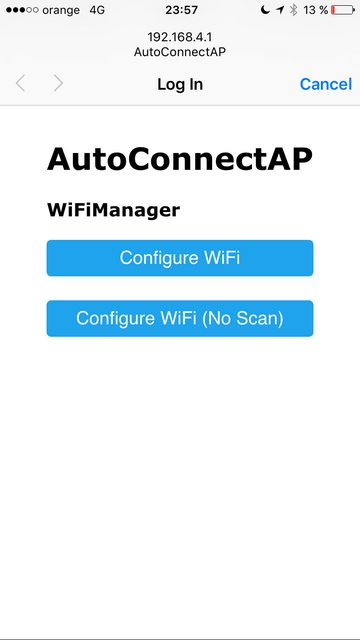

# Programmbeschreibung
## Wie es funktioniert
* Wenn die NodeMCU startet, versucht sie sich mit einem vorher gespeicherten AccessPoint zu verbinden
* Wenn das nicht klappt (oder noch nichts gespeichert wurde), Wird die NodeMCU als AccessPoint gestartet.
* Jetzt kann man sich mit diesem AccessPoint verbinden (z.B. mit dem Handy). Die SSID ist `NodeMCU-AP` und das Passwort ist `12345678`.
* Anschließend kann mit dem Webbrowser über die URL [http://192.168.4.1](http://192.168.4.1){target=_blank} die Konfigurationsseite geöffnet werden.
* Durch einen Klick auf `Configure WiFi` gelangt man zur Konfigurationsseite.
* Hier kann jetzt das WLAN Netzwerk gewählt werden und das Passwort eingegeben werden.
* Weitere Parameter können hier ebenso eingegeben werden (MQTT-Server etc...).
* Nach einem Klick auf `Save` werden die Werte dann im Internen Filesystem gespeichert und die NodeMCU resettet.
* Nach dem Reset sollte sich die NodeMCU mit dem konfigurierten AccessPoint verbinden.

| Home| Config |
|-|-|
|  |  |

## Was es macht
In der Regentonne ist ein Schwimmerschalter, der in Reihe zu den 2 verbauten Relais geschaltet ist. Die Pumpe wird eingeschaltet, wenn der Wasserstand in der Tonne hoch genug ist, beide Relais nicht geschaltet sind und der Schalter "Auto/Off" auf "Auto" steht. 

K1 wird geschaltet, wenn der IBC-Container voll ist. K2 kann durch das Programm geschaltet werden. Im Moment wird das Relais geschaltet, wenn der Schalter "Auto/Off" in der Position "OFF" steht.

Die Pumpe läuft also nur, wenn die Tonne **voll** ist und der IBC-Container **nicht voll** ist und der Schalter "Auto/Off" auf **"Auto"** steht.

## MQTT
Ist der Zugang zum WLAN konfiguriert und es besteht eine Verbindung, wird der Status per MQTT übertragen. Der MQTT-Pfad besteht aus dem Tag `rainibc` gefolgt von der `CHIP_ID` und dem `Namen des Wertes`. 

### Beispiel
```
`rainibc/6658263/level`
```


### Werte
Folgende Werte können ausgewertet werden:

| Name    | MQTT Pfad               | mögliche Werte | Datentyp | Beschreibung                                                                          |
|:--------|:------------------------|:---------------|:---------|:--------------------------------------------------------------------------------------|
| dist    | rainibc/CHIP_ID/dist    | 20 - 120 [cm]  | Integer  | Entspricht der gemessenen Entfernung des Ultraschall Füllstandsmessers                |
| swmax   | rainibc/CHIP_ID/swmax   | LOW / HIGH     | String   | "HIGH" = IBC Container voll, "LOW"= noch nicht voll                                   |
| swpump  | rainibc/CHIP_ID/swpump  | LOW / HIGH     | String   | Zustand des Schalters "Auto/Off". "HIGH" = eingeschaltet, "LOW"= Pumpensteuerung aus. |
| level   | rainibc/CHIP_ID/level   | 0 - 1000       | Integer  | Füllstand des IBC Containers in Liter.                                                |
| relpump | rainibc/CHIP_ID/relpump | LOW / HIGH     | String   | Zustand des Relais 2. "HIGH" = angezogen, "LOW" = abgefallen                          |

Für spätere Versionen sind weitere Werte wie WLan Signalstärke etc. denkbar.

