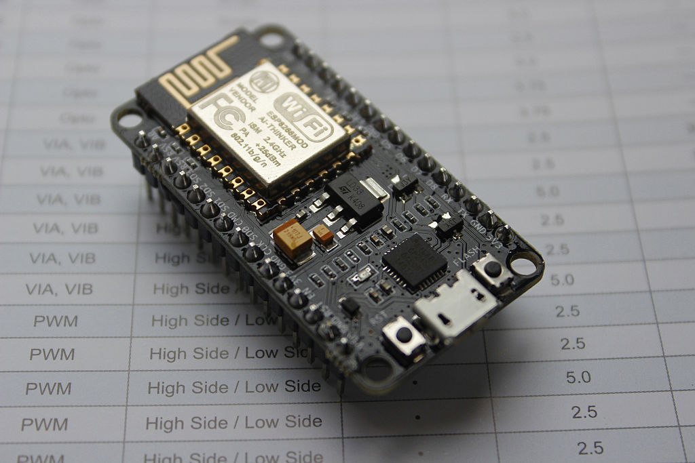
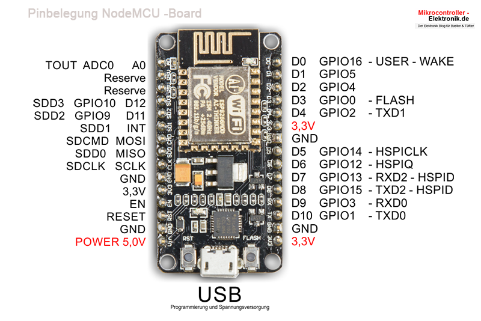
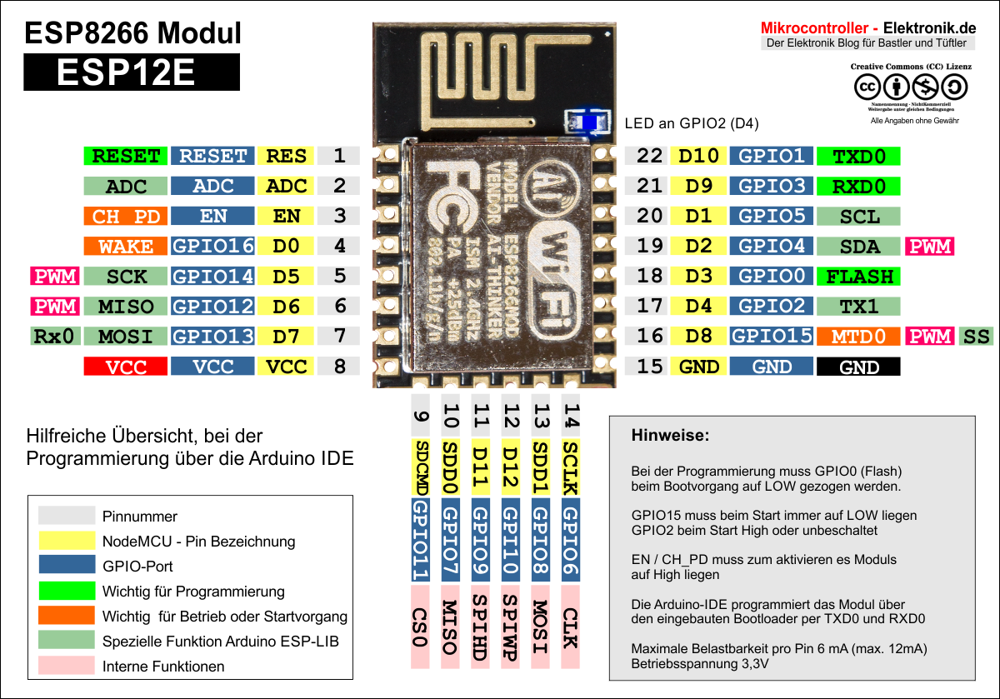

# NodeMCU

Die NodeMCU ist im Prinzip ein ESP12E mit einer Seriellen USB Schnittstelle und einem Spannungsregler für die 3,3V. Hinzu kommt noch eine Logik, die den Upload von Programmen aus der IDE vereinfacht und ein paar Pullups/Pulldowns. Programme, die auf der NodeMCU geschrieben wurden, können 1:1 auf ein eigenes Projekt mit dem ESP12E umgesetzt werden.

## Pinbelegung

## Funktionen

## Best Pins to Use – ESP8266

One important thing to notice about ESP8266 is that the GPIO number doesn’t match the label on the board silkscreen. For example, D0 corresponds to GPIO16 and D1 corresponds to GPIO5.

The following table shows the correspondence between the labels on the silkscreen and the GPIO number as well as what pins are the best to use in your projects, and which ones you need to be cautious.

The pins highlighted in green are OK to use. The ones highlighted in yellow are OK to use, but you need to pay attention because they may have unexpected behavior mainly at boot. The pins highlighted in red are not recommended to use as inputs or outputs.
| Label | GPIO   | Input         | Output                | Notes                                                             |
|-------|--------|---------------|-----------------------|-------------------------------------------------------------------|
| D0    | GPIO16 | no interrupt  | no PWM or I2C support | HIGH at boot. Used to wake up from deep sleep                     |
| D1    | GPIO5  | OK            | OK                    | often used as SCL (I2C)                                           |
| D2    | GPIO4  | OK            | OK                    | often used as SDA (I2C)                                           |
| D3    | GPIO0  | pulled up     | OK                    | connected to FLASH button, boot fails if pulled LOW               |
| D4    | GPIO2  | pulled up     | OK                    | HIGH at boot. Connected to on-board LED, boot fails if pulled LOW |
| D5    | GPIO14 | OK            | OK                    | SPI (SCLK)                                                        |
| D6    | GPIO12 | OK            | OK                    | SPI (MISO)                                                        |
| D7    | GPIO13 | OK            | OK                    | SPI (MOSI)                                                        |
| D8    | GPIO15 | pulled to GND | OK                    | SPI (CS). Boot fails if pulled HIGH                               |
| RX    | GPIO3  | OK            | RX pin                | HIGH at boot                                                      |
| TX    | GPIO1  | TX pin        | OK                    | HIGH at boot. Debug output at boot, boot fails if pulled LOW      |
| A0    | ADC0   | Analog Input  | X                     |                                                                   |

Continue reading for a more detailled and in-depth analysis of the ESP8266 GPIOs and its functions.
GPIOs connected to the Flash Chip

GPIO6 to GPIO11 are usually connected to the flash chip in ESP8266 boards. So, these pins are not recommended to use.
Pins used during Boot

The ESP8266 can be prevented from booting if some pins are pulled LOW or HIGH. The following list shows the state of the following pins on BOOT:

    GPIO16: pin is high at BOOT
    GPIO0: boot failure if pulled LOW
    GPIO2: pin is high on BOOT, boot failure if pulled LOW
    GPIO15: boot failure if pulled HIGH
    GPIO3: pin is high at BOOT
    GPIO1: pin is high at BOOT, boot failure if pulled LOW
    GPIO10: pin is high at BOOT
    GPIO9: pin is high at BOOT

Pins HIGH at Boot

There are certain pins that output a 3.3V signal when the ESP8266 boots. This may be problematic if you have relays or other peripherals connected to those GPIOs. The following GPIOs output a HIGH signal on boot:

    GPIO16
    GPIO3
    GPIO1
    GPIO10
    GPIO9

Additionally, the other GPIOs, except GPIO5 and GPIO4, can output a low-voltage signal at boot, which can be problematic if these are connected to transistors or relays. You can read this article that investigates the state and behavior of each GPIO on boot.
Mediavine

GPIO4 and GPIO5 are the most safe to use GPIOs if you want to operate relays.

## Analog Input

The ESP8266 only supports analog reading in one GPIO. That GPIO is called ADC0 and it is usually marked on the silkscreen as A0.

The maximum input voltage of the ADC0 pin is 0 to 1V if you’re using the ESP8266 bare chip. If you’re using a development board like the ESP8266 12-E NodeMCU kit, the voltage input range is 0 to 3.3V because these boards contain an internal voltage divider.

## On-board LED

Most of the ESP8266 development boards have a built-in LED. This LED is usually connected to GPIO2.
ESP8266 NodeMCU On-board LED

The LED is connected to a pull-down resistor, so when you send a HIGH signal the LED turns off.
RST Pin

When the RST pin is pulled LOW, the ESP8266 resets. This is the same as pressing the on-board RESET button.
ESP8266 NodeMCU On-board Reset button

## GPIO0

When GPIO0 is pulled LOW, it sets the ESP8266 into bootloader mode. This is the same as pressing the on-board FLASH/BOOT button.

## GPIO16

GPIO16 can be used to wake up the ESP8266 from deep sleep. To wake up the ESP8266 from deep sleep, GPIO16 should be connected to the RST pin. Learn how to put the ESP8266 into deep sleep mode:

## I2C

The ESP8266 doens’t have hardware I2C pins, but it can be implemented in software. So you can use any GPIOs as I2C. Usually, the following GPIOs are used as I2C pins:

    GPIO5: SCL
    GPIO4: SDA

## SPI

The pins used as SPI in the ESP8266 are:

    GPIO12: MISO
    GPIO13: MOSI
    GPIO14: SCLK
    GPIO15: CS

## PWM Pins

ESP8266 allows software PWM in all I/O pins: GPIO0 to GPIO16. PWM signals on ESP8266 have 10-bit resolution. Learn how to use ESP8266 PWM pins:

    ESP8266 PWM with Arduino IDE
    ESP8266 PWM with MicroPython 

## Interrupt Pins

The ESP8266 supports interrupts in any GPIO, except GPIO16.

## Links
* [Hersteller Seite](http://www.nodemcu.com/index_en.html){target=_blank}
* [Hardware bei GitHub](https://github.com/nodemcu/nodemcu-devkit-v1.0){target=_blank}
* [Deutsches Forum](https://www.roboternetz.de/community/forums/77-NodeMCU-Board-und-ESP8266-ESP32-Serie){target=_blank}
* [Recht gute Beschreibung](https://www.mikrocontroller-elektronik.de/nodemcu-esp8266-tutorial-wlan-board-arduino-ide/){target=_blank}
* [Beschreibung der Pins](https://randomnerdtutorials.com/esp8266-pinout-reference-gpios/){target=_blank}